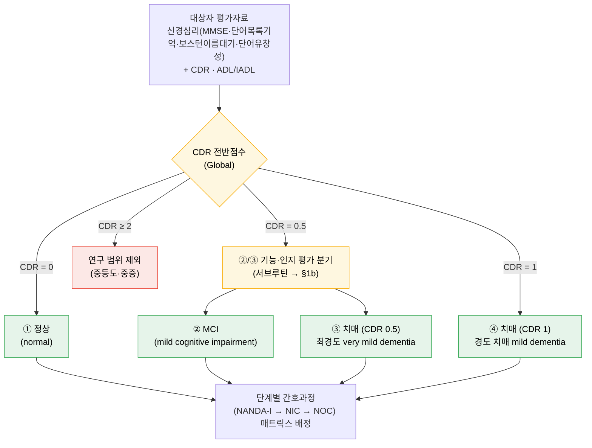
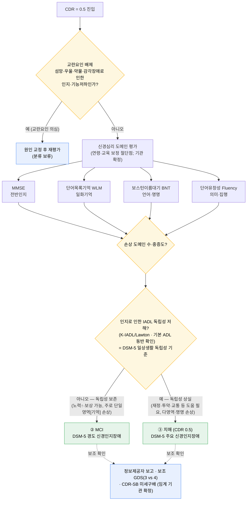

# 4집단 분류 판정 알고리즘 (Classification Decision Flowchart)
## 정상 · MCI · 치매(CDR 0.5) · 치매(CDR 1)

> **목적**: 연구대상을 4집단으로 배정하는 **판정 절차를 한눈에** 보이게 하여, IRB 심의와
> 분류자(평가자) 간 일관성을 확보한다. 핵심 난점은 **MCI와 치매(CDR 0.5)가 CDR 점수(0.5)에서
> 겹친다**는 점이며, 이를 **신경심리 도메인 평가 + 일상생활 독립성(DSM-5 기준)**으로 가른다.
> → 분류 축 = **CDR + 신경심리(MMSE·단어목록기억·보스턴이름대기·단어유창성) + ADL/IADL**.
>
> 상세 표·근거는 `01-research-design.md` 4절, 단계별 진행은 `00-research-roadmap-guide.md`,
> 도구·문헌 근거는 `02-literature-review.md` §2-8을 참조.

---

## 1. 판정 흐름도 — 메인 (Mermaid)

> CDR 전반점수로 1차 라우팅한다. **CDR 0.5**만 ②/③ 구분이 필요하므로, 이 경로는
> **§1b 세부 알고리즘**(서브루틴)으로 넘긴다.



---

## 1b. ②/③ 분기 세부 알고리즘 (CDR 0.5 → MCI vs 치매)

> **두 축으로 판정한다**: ① **인지영역 심각도**(신경심리 4종 도메인) × ② **일상생활 독립성**
> (IADL/ADL). 핵심 결정점은 **DSM-5 주요 vs 경도 신경인지장애 기준 = "인지손상이 일상생활
> 독립성을 저해하는가"**이며, 그 판단을 신경심리 도메인 결과와 IADL로 **조작화**한다.



> **왜 이 네 검사인가**: 각각 다른 인지영역을 측정해 ②/③의 손상 양상을 구분한다 —
> MMSE(전반), 단어목록기억(일화기억; amnestic MCI의 최조기 표지), 보스턴이름대기(언어·명명;
> 치매에서 더 두드러짐), 단어유창성(의미·집행). 네 검사는 **CERAD-K 신경심리 배터리**의 핵심
> 구성요소다(Lee et al., 2002).

---

## 2. 판정 조작적 정의 표

| 집단 | CDR(Global) | 신경심리 도메인(MMSE·WLM·BNT·Fluency) | ADL/IADL 독립성 | 진단기준(DSM-5) | 보조 GDS | 자료원 |
|------|-------------|----------------------------------------|------------------|------------------|----------|--------|
| ① 정상 | 0 | 정상 범위 | 독립 | 해당 없음 | 1–2 | 조기검진 |
| ② MCI | 0.5 | 주로 **단일영역(기억)** 저하, MMSE 정상~경계 | **IADL 독립 보존**(노력↑·보상) | **경도** 신경인지장애 | 3 | 조기검진 |
| ③ 치매(CDR 0.5) | 0.5 | **다영역**·명명(BNT) 손상 흔함 | **IADL 독립 상실**(도움 필요) | **주요** 신경인지장애 | 4 | 조기검진/EMR |
| ④ 치매(CDR 1) | 1 | 명확한 다영역 저하 | IADL·일부 ADL 손상 | 주요 신경인지장애 | 4 | EMR/조기검진 |
| (제외) | ≥ 2 | 광범위 저하 | 광범위 손상 | — | ≥ 5 | — |

### ②/③ 전용 판별 체크리스트 (둘 다 CDR 0.5)

| 판별 항목 | ② MCI | ③ 치매(CDR 0.5) |
|-----------|-------|------------------|
| 교란요인(섬망·우울·약물·감각) | 배제됨 | 배제됨 |
| 손상 인지 도메인 수 | 보통 **단일**(주로 기억) | **다영역**(기억 + 언어/집행 등) |
| MMSE(전반) | 정상~경계 | 경계~저하 |
| 단어목록기억(WLM, 일화기억) | 저하 가능(amnestic형) | 저하 |
| 보스턴이름대기(BNT, 명명) | 대체로 보존 | **손상 흔함**(치매 표지) |
| 단어유창성(의미·집행) | 경미 저하 가능 | 저하 |
| IADL 독립성 | **보존**(노력↑·보상 가능) | **상실**(재정·투약·교통 등 도움) |
| 기본 ADL | 독립 | 대체로 독립(초기) |
| **DSM-5 분류** | **경도** 신경인지장애 | **주요** 신경인지장애 |

> **②와 ③의 분기 규칙(핵심)**: 둘 다 CDR 0.5다. **DSM-5 독립성 기준**(인지손상이 일상생활
> 독립성을 저해하는가)으로 가르며, 그 판단을 **신경심리 4종 도메인 + IADL**로 조작화한다.
> 사용 도구의 **절단점은 연령·교육 보정**이 필요하고, **IRB 전에 확정·명문화**하며 분류자 간
> 신뢰도(예: κ)를 보고할 것.

---

## 3. 텍스트 대체 흐름도 (Mermaid 미지원 환경)

```
대상자 평가자료
  · 신경심리: MMSE · 단어목록기억(WLM) · 보스턴이름대기(BNT) · 단어유창성(Fluency)
  · CDR · ADL/IADL
        │
        ▼
   CDR 전반점수?
   ├─ 0 ───────────────────────────────────────► ① 정상
   ├─ 0.5 ─► [②/③ 세부 알고리즘]
   │           1) 교란요인 배제(섬망·우울·약물·감각)?
   │                ├─ 예 → 원인 교정 후 재평가(보류)
   │                └─ 아니오 ↓
   │           2) 신경심리 도메인 평가(연령·교육 보정 절단점)
   │                : MMSE / WLM / BNT / Fluency → 손상 도메인 수·중증도
   │           3) 인지로 인한 IADL 독립성 저해?(= DSM-5 독립성 기준)
   │                ├─ 아니오(독립 보존, 단일영역) ──────► ② MCI (경도 NCD)
   │                └─ 예(독립 상실, 다영역·명명) ───────► ③ 치매(CDR 0.5) (주요 NCD)
   │           (보조) 정보제공자 보고 · GDS(3 vs 4) · CDR-SB 미세구배
   ├─ 1 ───────────────────────────────────────► ④ 치매(CDR 1)
   └─ ≥2 ──────────────────────────────────────► (제외: 중등도·중증)
        │
        ▼
  4집단 각각 → 간호진단(NANDA-I) → 간호중재(NIC) → 간호평가(NOC) 매트릭스
```

---

## 4. 판정 주의·근거

- **CDR 0.5의 모호성**: CDR 0.5는 "questionable/very mild"로, MCI와 최경도 치매를 모두 포괄할
  수 있다. 따라서 **CDR 점수 단독 분류는 ②/③을 구분하지 못한다** → 신경심리 도메인 + 진단기준
  병용이 필수.
- **신경심리 4종의 판별 역할**: 단어목록기억·단어유창성은 정상↔치매를 가장 잘 가르는 검사로
  보고되며(Alegret et al., 2013), 보스턴이름대기의 **명명 손상은 치매(AD)에서 두드러지나 amnestic
  MCI에서는 예측력이 약하다**(Aniwattanapong et al., 2018) → ②/③ 분기의 직접 근거.
  CERAD-K 배터리(MMSE·WLM·BNT·Fluency 포함)는 정상–MCI–치매를 유의하게 판별한다(Lee et al., 2002);
  도메인별(기억/언어/집행) 판별과 MCI↔치매 구분 가능성도 보고된다(Kim et al., 2025).
- **독립성 축의 근거**: IADL은 MCI→치매 **진행의 예측인자**로, 기능 독립성을 ②/③ 판별축으로
  삼는 근거가 된다(Kim & Kim, 2025, *J Korean Acad Nurs*). DSM-5 주요/경도 신경인지장애의 분기
  기준이 곧 "일상생활 독립성 저해 여부"다(원전 확인 요).
- **교란요인 배제**: 섬망·우울·약물·감각장애로 인한 기능·인지저하를 신경인지장애로 귀인하기
  전에 반드시 배제한다(미배제 시 분류 보류·재평가).
- **분류 축 보강**: CDR은 정상–MCI–치매 판별에서 높은 정확도가 보고된다(메타분석; Huang HC et al.,
  2020). GDS는 보조 단계지표로 병기 가능(Reisberg et al., 1982).
- **선별→분류→중재 파이프라인**: 간호사 주도 지역사회 인지선별로 정상/MCI/CI를 분류하고 중재로
  연계한 선례가 있다(Yang et al., 2014; 선별 흐름도 제안 Zhuang et al., 2019).
- **자료원 정합성**: 조기검진·신경심리 자료는 초기 단계(정상~경도)에 강하므로 4집단 범위와
  일치한다. 중등도·중증(CDR 2~3)을 제외하는 것은 의도적 경계다(상세 `01` 4절).

---

## 5. 출처

> PubMed 검증분(*According to PubMed*)은 PMID/DOI를 함께 표기한다. DSM-5 등 비-PubMed 표준은
> **원전에서 직접 확인**해야 하며 가짜 식별자를 만들지 않는다. 신경심리 도구·절단점은
> **연령·교육 보정** 후 **기관·지도교수와 확정**한다.

**PubMed 검증 — 신경심리 도구·②/③ 판별 근거**
- Lee, J. H., et al. (2002). Development of the Korean version of the CERAD Assessment Packet
  (CERAD-K): Clinical and neuropsychological assessment batteries. *J Gerontol B Psychol Sci Soc
  Sci, 57*(1), P47–P53. [DOI](https://doi.org/10.1093/geronb/57.1.p47) (PMID: 11773223)
- Aniwattanapong, D., et al. (2018). Validation of the Thai version of the short Boston Naming
  Test (T-BNT) in Alzheimer's dementia and MCI: Clinical and biomarker correlates. *Aging Ment
  Health, 23*(7), 840–850. [DOI](https://doi.org/10.1080/13607863.2018.1501668) (PMID: 30351202)
- Alegret, M., et al. (2013). Cut-off scores of a brief neuropsychological battery (NBACE) for
  Spanish individual adults older than 44 years old. *PLoS One, 8*(10), e76436.
  [DOI](https://doi.org/10.1371/journal.pone.0076436) (PMID: 24146868)
- Kim, Y. J., et al. (2025). Clinical utility and diagnostic accuracy of the tablet-based Seoul
  Cognitive Status Test (validated vs. CERAD-K / SNSB-II). *Dement Neurocogn Disord, 24*(4),
  286–300. [DOI](https://doi.org/10.12779/dnd.2025.24.4.286) (PMID: 41220867)
- Kim, H. J., & Kim, H. Y. (2025). Nomogram for predicting changes in cognitive function in
  community-dwelling older adults with MCI (KLoSA): IADL among progression predictors. *J Korean
  Acad Nurs, 55*(1), 50–63. [DOI](https://doi.org/10.4040/jkan.24059) (PMID: 40012456)

**PubMed 검증 — 분류 축(CDR/GDS)·파이프라인**
- Morris, J. C. (1993). The Clinical Dementia Rating (CDR): Current version and scoring rules.
  *Neurology, 43*(11), 2412–2414. [DOI](https://doi.org/10.1212/wnl.43.11.2412-a) (PMID: 8232972)
- Reisberg, B., et al. (1982). The Global Deterioration Scale for assessment of primary
  degenerative dementia. *Am J Psychiatry, 139*(9), 1136–1139.
  [DOI](https://doi.org/10.1176/ajp.139.9.1136) (PMID: 7114305)
- Huang, H.-C., et al. (2020). Diagnostic accuracy of the Clinical Dementia Rating Scale for
  detecting MCI and dementia: A bivariate meta-analysis. *Int J Geriatr Psychiatry, 36*(2),
  239–251. [DOI](https://doi.org/10.1002/gps.5436) (PMID: 32955146)
- Zhuang, L., et al. (2019). Cognitive assessment tools for mild cognitive impairment screening.
  *J Neurol, 268*(5), 1615–1622. [DOI](https://doi.org/10.1007/s00415-019-09506-7) (PMID: 31414193)
- Yang, Y., et al. (2014). Nurse-led cognitive screening model for older adults in primary care.
  *Geriatr Gerontol Int, 15*(6), 721–728. [DOI](https://doi.org/10.1111/ggi.12339) (PMID: 25257051)

**비-PubMed 표준 (원전 확인 요)**
- American Psychiatric Association. *DSM-5 / DSM-5-TR* — 주요/경도 신경인지장애(major/mild
  neurocognitive disorder) 진단기준. ②/③ 분기의 **독립성 기준** 근거.
- 신경심리 절단점(MMSE·단어목록기억·보스턴이름대기·단어유창성)·K-ADL/K-IADL: 사용 도구·절단점은
  **연령·교육 보정** 후 지도교수·기관과 확정.

> ⚠ 저자·연도는 PubMed 메타데이터 기준이다. 제출 전 각 DOI 원문에서 서지정보를 최종 대조하라.
