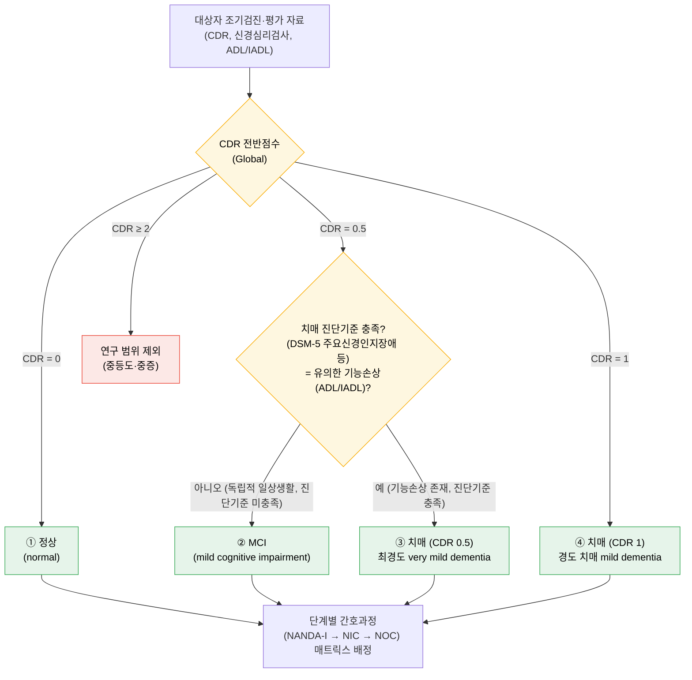

# 4집단 분류 판정 알고리즘 (Classification Decision Flowchart)
## 정상 · MCI · 치매(CDR 0.5) · 치매(CDR 1)

> **목적**: 연구대상을 4집단으로 배정하는 **판정 절차를 한눈에** 보이게 하여, IRB 심의와
> 분류자(평가자) 간 일관성을 확보한다. 핵심 난점은 **MCI와 치매(CDR 0.5)가 CDR 점수(0.5)에서
> 겹친다**는 점이며, 이를 **진단기준(기능손상 유무)**으로 가른다. → 분류 축 = **CDR + 진단기준**.
>
> 상세 표·근거는 `01-research-design.md` 4절, 단계별 진행은 `00-research-roadmap-guide.md` 참조.

---

## 1. 판정 흐름도 (Mermaid)



---

## 2. 판정 조작적 정의 표

| 집단 | CDR(Global) | 진단기준(기능손상) | 보조: GDS | 자료원 | 비고 |
|------|-------------|--------------------|-----------|--------|------|
| ① 정상 | 0 | 해당 없음(인지 정상) | 1–2 | 조기검진 | 검진 정상군 |
| ② MCI | 0.5 | **미충족** — ADL/IADL 독립 유지, 치매 진단기준 불충족 | 3 | 조기검진 | 경도인지장애 |
| ③ 치매(CDR 0.5) | 0.5 | **충족** — 유의한 기능손상, 치매 진단기준 충족 | 4 | 조기검진/EMR | very mild dementia |
| ④ 치매(CDR 1) | 1 | 충족 — 명확한 기능손상 | 4 | EMR/조기검진 | mild dementia |
| (제외) | ≥ 2 | — | ≥ 5 | — | 중등도·중증, 범위 밖 |

> **②와 ③의 분기 규칙(핵심)**: 둘 다 CDR 0.5다. **치매 진단기준 충족 여부**(예: DSM-5 주요
> 신경인지장애 — 일상생활 독립성을 저해하는 인지저하)로만 가른다. 이 판정의 **조작적 정의와
> 사용 도구(예: K-IADL, Bayer-ADL, 임상의 진단)를 IRB 전에 확정·명문화**하고, 분류자 간
> 신뢰도(평가자 간 일치도, 예: κ)를 보고할 것.

---

## 3. 텍스트 대체 흐름도 (Mermaid 미지원 환경)

```
대상자 평가자료(CDR · 신경심리 · ADL/IADL)
        │
        ▼
   CDR 전반점수?
   ├─ 0 ───────────────────────────────► ① 정상
   ├─ 0.5 ─► 치매 진단기준 충족(기능손상)?
   │          ├─ 아니오(독립) ──────────► ② MCI
   │          └─ 예(기능손상) ──────────► ③ 치매(CDR 0.5)
   ├─ 1 ───────────────────────────────► ④ 치매(CDR 1)
   └─ ≥2 ──────────────────────────────► (제외: 중등도·중증)
        │
        ▼
  4집단 각각 → 간호진단(NANDA-I) → 간호중재(NIC) → 간호평가(NOC) 매트릭스
```

---

## 4. 판정 주의·근거

- **CDR 0.5의 모호성**: CDR 0.5는 "questionable/very mild"로, MCI와 최경도 치매를 모두 포괄할
  수 있다. 따라서 **CDR 점수 단독 분류는 ②/③을 구분하지 못한다** → 진단기준 병용이 필수.
- **분류 축 정당화**: CDR은 정상–MCI–치매 판별에서 높은 정확도가 보고된다(메타분석 CDR-GS의
  MCI 민감도 93%·특이도 97%; Huang HC et al., 2020). GDS는 보조 단계지표로 병기 가능
  (Reisberg et al., 1982).
- **선별→분류→중재 파이프라인**: 간호사 주도 지역사회 인지선별로 정상/MCI/CI를 분류하고 중재로
  연계한 선례가 있다(Yang et al., 2014; 선별 흐름도 제안 Zhuang et al., 2019).
- **자료원 정합성**: 조기검진 자료는 초기 단계(정상~경도)에 강하므로 4집단 범위와 일치한다.
  중등도·중증(CDR 2~3)을 제외하는 것은 의도적 경계다(상세 `01` 4절).

---

## 5. 출처

> PubMed 검증분(*According to PubMed*)은 PMID/DOI를 함께 표기한다. DSM-5 등 비-PubMed 표준은
> **원전에서 직접 확인**해야 하며 가짜 식별자를 만들지 않는다.

**PubMed 검증**
- Morris, J. C. (1993). The Clinical Dementia Rating (CDR): Current version and scoring rules.
  *Neurology, 43*(11), 2412–2414. [DOI](https://doi.org/10.1212/wnl.43.11.2412-a) (PMID: 8232972)
- Reisberg, B., et al. (1982). The Global Deterioration Scale for assessment of primary
  degenerative dementia. *Am J Psychiatry, 139*(9), 1136–1139.
  [DOI](https://doi.org/10.1176/ajp.139.9.1136) (PMID: 7114305)
- Huang, H.-C., et al. (2020). Diagnostic accuracy of the Clinical Dementia Rating Scale for
  detecting MCI and dementia: A bivariate meta-analysis. *Int J Geriatr Psychiatry, 36*(2),
  239–251. [DOI](https://doi.org/10.1002/gps.5436) (PMID: 32955146)
- Zhuang, L., et al. (2019). Cognitive assessment tools for mild cognitive impairment screening.
  *J Neurol, 268*(5), 1615–1622. [DOI](https://doi.org/10.1007/s00415-019-09506-7) (PMID: 31414193)
- Yang, Y., et al. (2014). Nurse-led cognitive screening model for older adults in primary care.
  *Geriatr Gerontol Int, 15*(6), 721–728. [DOI](https://doi.org/10.1111/ggi.12339) (PMID: 25257051)

**비-PubMed 표준 (원전 확인 요)**
- American Psychiatric Association. *DSM-5 / DSM-5-TR* — 주요/경도 신경인지장애(major/mild
  neurocognitive disorder) 진단기준. ②/③ 분기의 진단 근거.
- 기능평가 도구(예: K-IADL, Bayer-ADL): 사용 도구·절단점은 지도교수·기관과 확정.

> ⚠ 저자·연도는 PubMed 메타데이터 기준이다. 제출 전 각 DOI 원문에서 서지정보를 최종 대조하라.
